

FIRST DRAFT - NOT READY FOR SUBMISSION

<h1>Draft status and submission metadata</h1>

**Degree:** MSc Computer Science  
**School:** School of Computer Science, University of Birmingham  
**Supervisor:** Omid Pournik  
**Student ID:** [INSERT STUDENT ID]  
**Submission date:** [INSERT OFFICIAL SUBMISSION DATE]

# Abstract

This project designs and evaluates an AI-assisted mobile melanoma screening prototype that combines dermoscopic images with basic clinical metadata. The work addresses two connected problems: whether age, sex and anatomical site improve melanoma classification over an image-only baseline, and whether the resulting model can be incorporated into a usable end-to-end mobile workflow. The study uses the 33,126-image SIIM-ISIC 2020 training dataset, which contains 584 malignant lesions and therefore presents a severe class imbalance. An image-only ResNet50 model provides the baseline. The proposed model adds a compact multilayer perceptron for a 12-dimensional clinical vector and concatenates the resulting clinical representation with image features before binary classification. Both models were trained for eight epochs and evaluated on the same stratified validation set of 6,625 images, including 117 malignant cases.

The formal exported evaluation shows that multi-modal fusion improved area under the receiver operating characteristic curve (AUC) from 0.8550 to 0.8742, average precision from 0.1277 to 0.1519, malignant recall from 0.5128 to 0.5385, malignant F1 from 0.1560 to 0.1915, and balanced accuracy from 0.7109 to 0.7325. It also reduced false positives from 592 to 478 and false negatives from 57 to 54. A paired stratified bootstrap performed for this dissertation estimated an AUC improvement of 0.0192 with a 95% interval of 0.0070 to 0.0318. However, intervals for the improvement in average precision and recall included zero, and malignant precision remained only 0.1165. These results support a limited conclusion: the available clinical metadata improved internal validation discrimination, but the model is not sufficiently validated for clinical diagnosis.

The selected multi-modal model was integrated into a Flutter client, a FastAPI inference service and a SQLite persistence layer. The prototype supports authentication, image and metadata submission, risk-result display and prediction-history retrieval. The system demonstrates technical feasibility, not clinical effectiveness. The principal limitations are the single internal split, absence of external and subgroup validation, incomplete archived training code and checkpoint provenance, strong class imbalance, and the use of a default classification threshold. Future work should establish patient-level data separation, repeated or external evaluation, calibration, threshold selection linked to a screening use case, fairness analysis and prospective usability testing.

**Keywords:** melanoma screening; dermoscopy; multi-modal learning; clinical metadata; ResNet50; mobile health; class imbalance

# Acknowledgements

[AUTHOR TO COMPLETE. Acknowledge the supervisor, any technical or academic support, and dataset providers. Confirm the University's current rules before describing the use of generative AI tools.]

# Declaration and AI-use statement

[INSERT THE EXACT DECLARATION REQUIRED BY THE 2025/26 SCHOOL OF COMPUTER SCIENCE PROJECT HANDBOOK. Do not submit this placeholder. Add an AI-use statement if required by current University or module policy, accurately describing which parts were assisted and how the author verified them.]

# List of abbreviations

| Abbreviation | Meaning |
|---|---|
| AP | Average precision |
| API | Application programming interface |
| AUC / AUROC | Area under the receiver operating characteristic curve |
| CNN | Convolutional neural network |
| FN / FP | False negative / false positive |
| ISIC | International Skin Imaging Collaboration |
| JWT | JSON Web Token |
| MLP | Multilayer perceptron |
| MPS | Metal Performance Shaders |
| PR | Precision-recall |
| ROC | Receiver operating characteristic |
| TN / TP | True negative / true positive |

# 1. Introduction

## 1.1 Background and motivation

Skin-lesion assessment is a visually demanding classification problem. Lesions from different diagnostic categories can appear similar, while lesions within one category can vary with acquisition conditions, anatomical site and patient characteristics. Deep convolutional neural networks have shown that image representations can support skin-cancer classification under controlled evaluation conditions [@Esteva2017]. This evidence establishes technical potential, but it does not make an image classifier a clinical diagnostic system. Medical use additionally requires representative data, a clearly defined intended use, reliable validation, understandable outputs and integration into a workflow in which a qualified professional remains responsible for diagnosis.

Clinical assessment is also not purely image based. Patient age, sex and lesion location can alter prior risk and interpretation. The SIIM-ISIC 2020 dataset was designed to provide dermoscopic images together with patient and lesion context [@Rotemberg2021]. It contains 33,126 training images but only 584 melanomas, equivalent to approximately 1.76% of the dataset. This distribution makes overall accuracy an unsafe headline measure: a classifier that predicted every lesion as benign would be more than 98% accurate while detecting no melanoma. Precision-recall analysis, sensitivity, specificity, F1 and balanced accuracy are consequently necessary alongside ROC AUC [@Saito2015].

This project investigates a deliberately simple feature-level fusion design. A ResNet50 branch extracts image features; a small MLP encodes age, sex and anatomical site; and the two representations are concatenated before classification. The scientific comparison asks whether adding metadata improves performance on a fixed internal validation set. The engineering component then places the model behind a FastAPI service and connects it to a Flutter mobile client with authentication and prediction history.

## 1.2 Problem statement

The project addresses the following problem:

> Can a lightweight feature-level fusion model use routinely available clinical metadata to improve melanoma risk classification over an image-only ResNet50 baseline, and can that model be integrated into a traceable mobile screening prototype without presenting its output as a diagnosis?

The first part is an empirical model-comparison problem under severe class imbalance. The second is a software-engineering problem involving consistent preprocessing, API contracts, authentication, persistence and responsible presentation. A strong result must satisfy both parts: numerical improvement must be supported by a fair comparison, and software integration must preserve the semantics and limitations of the trained model.

## 1.3 Aim, research questions and objectives

The project aim is to design and evaluate an AI-assisted mobile melanoma screening system based on multi-modal fusion.

Three research questions guide the dissertation:

1. **RQ1:** How does an image-only ResNet50 baseline perform on the imbalanced SIIM-ISIC 2020 validation data when assessed with melanoma-focused metrics?
2. **RQ2:** Does feature-level fusion of image features with age, sex and anatomical site improve internal validation performance over the image-only baseline?
3. **RQ3:** Can the selected model be integrated into a mobile-to-backend workflow that accepts the required inputs, returns a risk-oriented result and stores user-specific prediction history?

The corresponding objectives are to prepare a reproducible image-and-metadata pipeline; establish an image-only baseline; implement a compact multi-modal model; compare both models on identical samples; analyse errors and threshold trade-offs; build a Flutter, FastAPI and SQLite prototype; and identify the technical, ethical and evidential work required before any clinical use could be considered.

## 1.4 Contributions

The dissertation makes four bounded contributions:

- It provides a controlled comparison between an image-only ResNet50 model and a simple image-plus-metadata fusion model on the same 6,625-image validation set.
- It reports metrics appropriate to severe imbalance and retains per-image predictions, training histories, confusion matrices, ROC curves, PR curves and threshold-sweep evidence.
- It adds a paired statistical analysis of the two stored prediction files, distinguishing improvements that are stable under internal resampling from those that remain uncertain.
- It demonstrates an end-to-end prototype connecting mobile input, authenticated backend inference and persistent prediction history while explicitly framing output as screening support.

These contributions concern internal experimental evidence and prototype engineering. They do not establish clinical safety, diagnostic equivalence to clinicians or population-level effectiveness.

## 1.5 Scope

The model addresses binary discrimination between benign and malignant lesions in the prepared SIIM-ISIC 2020 data. It does not classify multiple skin diseases, segment lesions, estimate prognosis or recommend treatment. The prototype uses backend PyTorch inference; local on-device inference and model quantisation are outside the implemented scope. The evaluation uses one internal validation split and does not include external data, prospective participants or clinician comparison. The stored application history is a prototype feature and is not designed as a production medical record.

## 1.6 Dissertation structure

Chapter 2 reviews image-based and multi-modal skin-lesion classification, imbalanced evaluation and mobile clinical decision support. Chapter 3 specifies the requirements and architecture. Chapter 4 describes data preparation, model design, training and evaluation. Chapter 5 discusses implementation. Chapter 6 presents results, including paired uncertainty analysis. Chapter 7 interprets the findings. Chapter 8 addresses ethics, safety and security. Chapter 9 states limitations and future work. Chapter 10 concludes against the research questions.

# 2. Literature Review

## 2.1 Deep learning for skin-lesion classification

CNNs learn hierarchical visual representations directly from images. In a prominent study, Esteva et al. trained a CNN on a large collection of clinical skin images and compared its discrimination with board-certified dermatologists on selected binary tasks [@Esteva2017]. The result motivated further work on automated skin-lesion analysis and suggested that mobile access could broaden the reach of image-based assessment. The study is nevertheless evidence from a specific controlled setting, not a general guarantee that a model will remain accurate across cameras, populations or workflows.

Residual networks address optimisation difficulties in deep architectures by learning residual functions through identity-based skip connections [@He2016]. ResNet50 offers a practical compromise between representational capacity, availability of ImageNet pretraining and computational cost. Transfer from natural-image pretraining does not remove the need for domain validation, but it supplies a stable image encoder for a controlled project baseline. This dissertation therefore uses ResNet50 for both the image-only and multi-modal experiments so that the principal difference is the presence of clinical metadata.

Evidence on medical imaging more broadly warrants caution. A systematic review and meta-analysis found strong reported diagnostic accuracy in many deep-learning studies but also identified weaknesses in design, reporting and the risk of overestimating performance [@Aggarwal2021]. The implication for this project is that high AUC alone cannot establish clinical utility. Dataset construction, split integrity, prevalence, threshold choice, calibration and external validation materially affect interpretation.

## 2.2 Clinical context and multi-modal learning

Multi-modal machine learning combines information from sources with different statistical structures. Baltrusaitis et al. describe fusion as a central challenge involving representation, alignment and combination of modalities [@Baltrusaitis2019]. In this project the modalities are a high-dimensional image and a low-dimensional structured clinical vector. Feature-level fusion is used because each branch can learn a modality-specific representation before a joint classifier models their interaction.

Prior skin-lesion studies give a rationale for this choice. Yap et al. combined imaging modalities with patient metadata and showed that non-image information can contribute to automated lesion classification [@Yap2018]. Ou et al. developed a deep multi-modal model using smartphone-collected clinical images and metadata, directly connecting fusion with mobile acquisition [@Ou2022]. More complex methods use attention or adversarial objectives to learn complementary information from clinical and dermoscopic images [@Wang2022]. These systems indicate that context can help, but their datasets, modalities, tasks and class distributions differ. Their numerical results are therefore not direct baselines for this dissertation.

The present work intentionally uses concatenation and a compact MLP. A simple fusion mechanism is easier to implement and inspect in a master's project, and it isolates the question of whether the available metadata adds information at all. Complexity would be justified only if a reliable simple baseline had been established and if additional experiments could distinguish the benefit of a more sophisticated fusion mechanism.

## 2.3 The SIIM-ISIC 2020 dataset

The SIIM-ISIC 2020 challenge dataset contains dermoscopic images, patient identifiers and metadata including approximate age, sex and general anatomical site [@ISIC2020; @Rotemberg2021]. The prepared training data used in this project contains 32,542 benign and 584 malignant images. The official dataset paper reports that malignant diagnoses were histopathologically confirmed, while benign examples were confirmed by expert agreement, follow-up or histopathology [@Rotemberg2021].

The dataset is suitable for the research question because image and structured context coexist. It also creates methodological risks. First, melanoma prevalence is low. Second, several images may belong to one patient. If a random image-level split places lesions from the same patient in training and validation, patient-specific correlations can inflate performance. The repository records a fixed stratified split but does not archive sufficient source code or a patient-level split manifest to prove patient separation. This is treated as a major reproducibility and validity limitation rather than assumed away.

## 2.4 Evaluation under severe class imbalance

ROC AUC measures ranking across thresholds and is insensitive to the class prevalence in a way that can obscure the practical burden of false positives. Precision-recall analysis focuses attention on positive predictions and is more informative when negatives greatly outnumber positives [@Saito2015]. For a screening-oriented classifier, sensitivity is important because false negatives may delay assessment; specificity and precision are also important because false positives can create anxiety and unnecessary referrals.

No single metric captures these competing consequences. This dissertation reports AUC, average precision, malignant recall, malignant precision, malignant F1, specificity, balanced accuracy and the confusion matrix. It also preserves threshold-sweep plots. The operating threshold is a policy choice tied to intended use and acceptable harms, not merely a training parameter. The default 0.5 threshold is useful for consistent model comparison but should not be presented as clinically optimal.

## 2.5 Human-AI interaction and deployment

Research on human-computer collaboration in skin-cancer recognition indicates that decision support should be evaluated as part of a human workflow rather than as an isolated score generator [@Tschandl2020]. A mobile prototype can make a trained model accessible, but accessibility increases the responsibility to communicate uncertainty. The system must avoid diagnostic language, show a medical disclaimer and direct users towards qualified assessment.

Flutter supports a shared codebase for mobile interfaces [@FlutterDocs], while FastAPI provides typed Python endpoints suited to model-serving prototypes [@FastAPIDocs]. Backend inference retains the PyTorch model and preprocessing in Python, reducing conversion risk during this project. The trade-off is dependence on network connectivity and the transfer of image and clinical information to a server. Production deployment would require stronger authentication, encryption, retention controls, audit logging, threat modelling and compliance analysis.

## 2.6 Research gap

Prior work establishes the potential of CNNs and multi-modal learning, but a useful master's project gap remains at the intersection of controlled comparison and system integration. The question is not whether the proposed architecture is a new state-of-the-art method. It is whether a small, auditable metadata branch produces measurable benefit over a matched image baseline, and whether that model can be integrated without losing traceability or overstating its role. The project addresses this gap with archived prediction-level evidence and a working prototype, while accepting that stronger validation is necessary for clinical claims.

# 3. Requirements and System Design

## 3.1 Stakeholders and intended use

The primary project stakeholder is the student-researcher, who needs a defensible model comparison and an implemented system. The supervisor and assessors require evidence connecting requirements, design decisions, experiments and conclusions. A potential end user needs a clear flow for selecting an image, entering metadata and understanding the result. Clinicians are not direct users in the present evaluation, but the clinical context constrains language and safety expectations.

The intended use is educational demonstration of AI-assisted screening. A user submits a lesion image and basic metadata; the system returns a model-estimated risk signal and a disclaimer. The output is not a diagnosis, referral decision or treatment recommendation.

## 3.2 Functional requirements

| ID | Requirement | Evidence recorded in repository |
|---|---|---|
| FR1 | Register and authenticate a user. | Integration log records register, login, current-user and bearer-token checks. |
| FR2 | Select or capture a lesion image. | Flutter detection workflow described in presentation and log-book. |
| FR3 | Collect age, sex and anatomical site. | Clinical form and standardised categories recorded in project evidence. |
| FR4 | Submit image and metadata to the inference service. | Multipart `/predict` request described in integration evidence. |
| FR5 | Apply preprocessing consistent with training. | Backend PyTorch deployment selected to keep logic aligned. |
| FR6 | Return label, probability and medical disclaimer. | Prediction response and result screen described in integration evidence. |
| FR7 | Save and retrieve authenticated prediction history. | SQLite `prediction_history` table and `/history` endpoint recorded. |

## 3.3 Non-functional requirements

The most important non-functional requirements are correctness of input mapping, reproducibility, safety, privacy and usability. Age normalisation and categorical encodings must match training. The backend must reject malformed input rather than silently substitute incompatible values. Experimental outputs must retain metrics, predictions and configuration. The result screen must distinguish a risk estimate from diagnosis. User and history data must be isolated by identity. A production system would additionally need measured latency and availability targets; these were not recorded in the current repository and cannot be claimed.

## 3.4 Architecture

<figure>
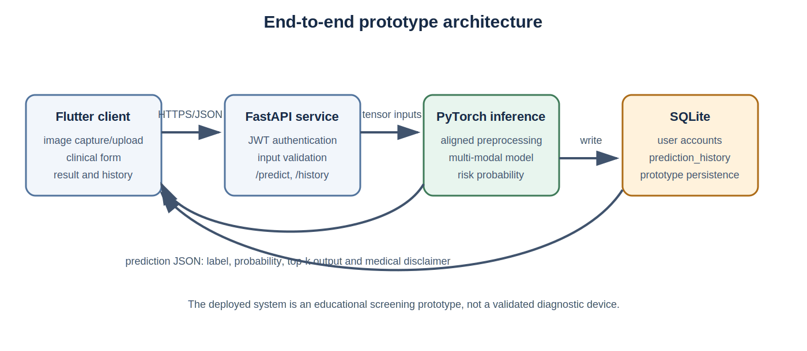
<figcaption>Figure 3.1. Prototype architecture reconstructed from the project log-book and mid-term presentation. Source-code files referenced by the presentation are not included in the evidence repository, so the diagram documents the reported design rather than an independent code audit.</figcaption>
</figure>

The Flutter client is responsible for interaction and session state. The FastAPI service authenticates requests, validates and decodes inputs, invokes PyTorch inference and formats the response. The model service uses the image and clinical vector expected by the multi-modal checkpoint. SQLite stores prototype accounts and prediction history. Separating the interface from model execution permits the model to remain in Python and allows the client to evolve independently, but it creates an API boundary at which preprocessing and category mismatches can occur.

## 3.5 Data flow and trust boundaries

The user supplies an image, age, sex and site. The client sends these fields with a bearer token. The backend crosses the first trust boundary: it must validate authentication, file type, size and clinical values. It then transforms the image and metadata into model inputs. The model returns a positive-class probability, which is mapped to a displayed label using a threshold. The service returns the result and records the event for the authenticated user.

The model output is untrusted from a safety perspective: a syntactically valid probability can still be wrong, poorly calibrated or out of distribution. The UI therefore requires a visible limitation statement. History data creates a second trust boundary because lesion images and clinical context can be sensitive even in a prototype. Production storage would need explicit consent, minimisation, deletion and access-control policies.

# 4. Methodology

## 4.1 Study design

The empirical study is a paired internal-validation comparison. Both models use the same prepared dataset, image resolution, validation samples, epoch budget, batch size and learning rate. The image-only model is the control. The multi-modal model changes the input and representation by adding a clinical branch. Per-image predictions allow direct paired comparison because each model is evaluated on the same lesion identifiers and labels.

This design can identify an association between the added metadata branch and performance on the internal split. It cannot isolate which metadata field causes improvement without ablations, and it cannot establish generalisation to another population.

## 4.2 Dataset preparation

The project evidence records 33,126 images: 32,542 benign and 584 malignant. Table 4.1 summarises the available metadata.

| Variable | Distribution |
|---|---|
| Target | 32,542 benign; 584 malignant |
| Sex | 15,981 female; 17,080 male; 65 unknown |
| Anatomical site | torso 16,845; lower extremity 8,417; upper extremity 4,983; head/neck 1,855; unknown 527; palms/soles 375; oral/genital 124 |
| Approximate age | mean 48.77; recorded range 0-90 |

The record states that images were resized for a 224 by 224 model input and normalised with ImageNet statistics. The training transform used random resized cropping, horizontal flipping, rotation and colour jitter. Validation used resize to 256 followed by a 224 centre crop, with no random augmentation. Age was divided by 100. Sex used four one-hot categories and anatomical site seven one-hot categories; together with age this produced a 12-dimensional vector. Missing categorical values mapped to `unknown`.

<strong>Verification requirement.</strong> The evidence repository does not include the dataset-preparation and training source files cited in the presentation. Before submission, the author must check the exact augmentation parameters, the four sex categories, duplicate handling, age-missing logic and patient-level split behaviour against the original code.

## 4.3 Data split

A fixed seed of 42 and an 80/20 stratified split are recorded. The resulting training set contains 26,501 images (26,034 benign and 467 malignant), while validation contains 6,625 images (6,508 benign and 117 malignant). Inspection of the two archived prediction files confirms that both models were evaluated on the same 6,625 image names in the same order with identical labels.

Stratification preserves class ratio but is not equivalent to grouping by patient. Because SIIM-ISIC 2020 is patient-centric, patient overlap must be excluded explicitly. No patient identifier is present in the archived prediction CSVs. This dissertation therefore describes the split as image-level stratified unless the author verifies a grouped split from the original implementation.

## 4.4 Models

### 4.4.1 Image-only baseline

The baseline receives only the dermoscopic image. A pretrained ResNet50 extracts a feature representation and a binary classifier produces benign and malignant scores. ResNet50 is held constant in the multi-modal model so that the baseline is directly comparable.

### 4.4.2 Multi-modal fusion model

<figure>
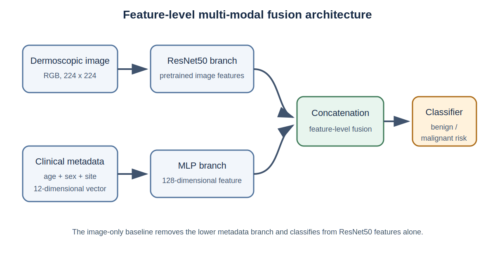
<figcaption>Figure 4.1. Recorded model design. The clinical branch maps the 12-dimensional metadata vector to a 128-dimensional feature, which is concatenated with the image representation before classification.</figcaption>
</figure>

The clinical MLP produces a 128-dimensional feature. Concatenation is a form of feature-level fusion: the classifier receives both learned representations and can use their joint pattern. The architecture is intentionally lightweight to reduce complexity and the risk of overfitting a small malignant class.

<strong>Missing implementation detail.</strong> The repository does not establish the exact ResNet feature dimension, MLP layer widths other than the 128-dimensional output, activation functions, dropout rate, loss function, optimiser, class weighting or learning-rate schedule. These items are required for reproducibility and must be copied from the original training code, not inferred.

## 4.5 Training configuration

Both formal runs used eight epochs, batch size 32, learning rate (10^{-4}), 224 by 224 inputs and Apple MPS. The project log states that `num_workers=0` was used for compatibility. Training and validation loss, accuracy and AUC were saved for every epoch.

The available artifacts create one checkpoint-selection ambiguity. The baseline history reaches its highest validation AUC, 0.8578, at epoch 7, but the formal baseline summary contains the epoch-8 AUC of 0.8550. The multi-modal summary corresponds to its peak history AUC of 0.8742 at epoch 5. The main comparison in Chapter 6 uses the two formal `metrics_summary.csv` files because these are the designated evaluation artifacts. A sensitivity statement also compares peak history AUCs, for which the improvement is 0.0164 rather than 0.0192.

## 4.6 Metrics

For malignant as the positive class,

\[
\mathrm{Recall}=\frac{TP}{TP+FN},\qquad
\mathrm{Specificity}=\frac{TN}{TN+FP},\qquad
\mathrm{Precision}=\frac{TP}{TP+FP}.
\]

F1 is the harmonic mean of precision and recall, and balanced accuracy is the mean of sensitivity and specificity. ROC AUC measures the probability that a randomly selected positive is ranked above a randomly selected negative. Average precision summarises precision across recall levels and is particularly useful in this imbalanced setting.

## 4.7 Paired uncertainty analysis

The archived probabilities enable an additional paired analysis. This dissertation uses 2,000 stratified bootstrap replicates with NumPy random seed 20260619. Each replicate samples 117 malignant and 6,508 benign indices with replacement, preserving pairing by applying the same indices to both models. The metric difference is multi-modal minus baseline; percentile 2.5% and 97.5% quantiles form the reported interval.

This analysis quantifies sampling variability within the stored validation set. It does not correct for reuse of the validation set during model selection, patient-level dependence or dataset shift. The intervals should therefore be interpreted as descriptive internal uncertainty, not confidence bounds for deployment performance.

## 4.8 Reproducibility strategy

The repository retains metric summaries, epoch histories, per-image predictions and vector figures. Paths were removed from prediction files, leaving image identifiers and labels. This is sufficient to recalculate reported evaluation metrics and perform paired comparisons. Reproduction of training remains incomplete because source code, dependency versions, split manifests, random-state controls and model checkpoints are not archived here. Appendix A specifies a minimum evidence package for the final submission.

# 5. System Implementation

## 5.1 Backend inference

The project uses FastAPI to expose model inference. The integration record describes endpoints for registration, login, the current user, prediction and history. The prediction endpoint accepts multipart image input plus age, sex, anatomical site and a top-k parameter. A bearer JWT associates the request with an authenticated account. The backend decodes the image, applies training-compatible preprocessing, constructs the clinical vector and executes the PyTorch checkpoint.

Keeping inference in PyTorch avoids a conversion step and permits reuse of Python preprocessing. The cost is that a server must remain available and receive the lesion data. A production implementation should use transport encryption, strict file limits, structured validation, rate limiting and secure secret management. None of those production properties should be inferred merely from the framework choice.

## 5.2 Mobile client

The Flutter client implements login and session flow, an educational home page, lesion input, clinical fields, result presentation and prediction history. Clinical site options must exactly match the categories used during training. A mismatch such as `head and neck` on the client versus `head/neck` in the encoder can silently place input in an unknown category or produce an invalid vector. A shared schema or generated API model would reduce this risk.

The result screen reports screening risk and includes a disclaimer. This wording is a functional safety control: the model was evaluated on a retrospective internal split and has low malignant precision, so a definitive diagnosis label would be misleading. Confidence should also be described carefully because a softmax probability is not automatically calibrated.

## 5.3 Persistence and history

SQLite stores local prototype accounts and a `prediction_history` table. After inference, the service records the authenticated user and prediction information; a history endpoint retrieves records for display in the app. This feature demonstrates stateful integration rather than a one-off inference demo.

For production use, storage of lesion information would require a defined lawful basis, consent and retention policy, encryption, deletion mechanisms, backup policy and audit trail. The current implementation is suitable only for controlled educational testing with non-identifiable or authorised data.

## 5.4 Integration verification

The experiment log records successful completion of the following sequence: authentication; lesion-image selection; clinical entry; request submission; multi-modal PyTorch inference; result display; history write; and history retrieval. This provides functional evidence at workflow level.

The repository does not include automated test output, screenshots, request/response fixtures or the referenced backend and Flutter source files. Consequently, this dissertation can report the integration test performed by the project but cannot independently audit code coverage, failure handling, security properties or reproducibility. Final evidence should add tests for invalid tokens, missing fields, unsupported files, unavailable backend, metadata-category mismatch and history isolation between users.

# 6. Results

## 6.1 Dataset imbalance

Only 584 of 33,126 prepared images are malignant. The validation set contains 117 malignant and 6,508 benign images. The positive prevalence is therefore 1.77%. This imbalance explains why both models can achieve accuracy above 0.90 while malignant precision remains below 0.12.

<figure>
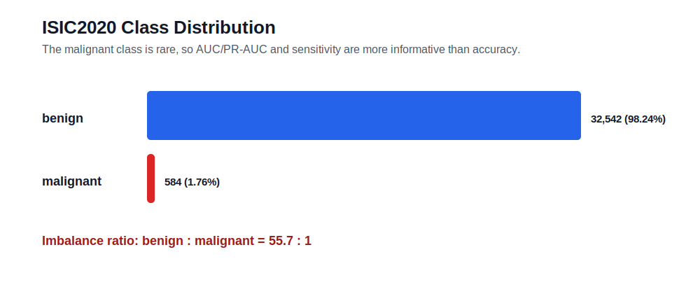
<figcaption>Figure 6.1. Class distribution of the prepared SIIM-ISIC 2020 data. The malignant class accounts for less than 2% of images.</figcaption>
</figure>

## 6.2 Training behaviour

<figure>
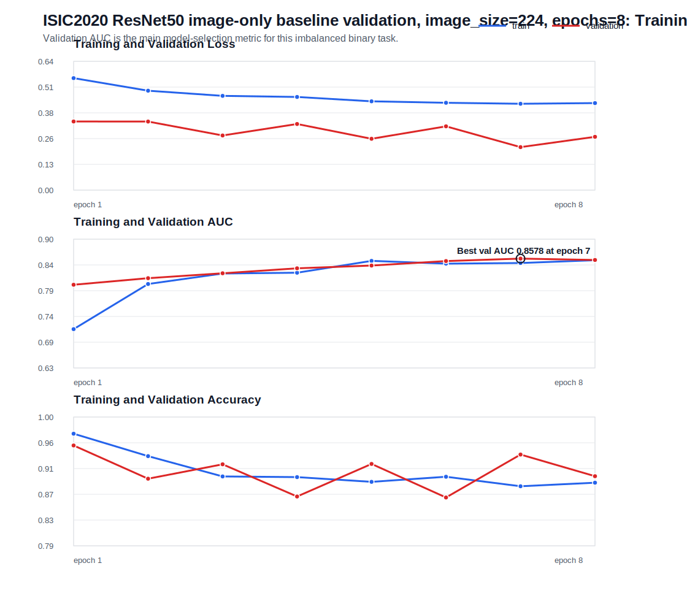
<figcaption>Figure 6.2. Image-only baseline training and validation history across eight epochs.</figcaption>
</figure>

The baseline training loss fell from 0.5544 to 0.4309, and training AUC rose from 0.7125 to 0.8545. Validation AUC improved from 0.8039 at epoch 1 to a maximum of 0.8578 at epoch 7, then decreased to 0.8550. Validation accuracy fluctuated between 0.8667 and 0.9529, showing why accuracy is an unstable selection measure under this imbalance.

<figure>
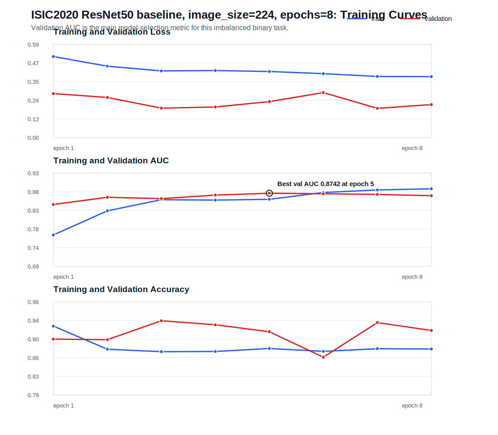
<figcaption>Figure 6.3. Multi-modal training and validation history across eight epochs.</figcaption>
</figure>

The multi-modal training loss fell from 0.5113 to 0.3848, while training AUC rose from 0.7677 to 0.8855. Validation AUC peaked at 0.8742 in epoch 5 and ended at 0.8678. The divergence between continued training improvement and plateauing validation AUC suggests that later epochs did not improve generalisation. With only one run, this pattern is suggestive rather than proof of overfitting.

## 6.3 Formal model comparison

| Metric | Image-only | Multi-modal | Absolute change |
|---|---:|---:|---:|
| ROC AUC | 0.8550 | **0.8742** | +0.0192 |
| Average precision | 0.1277 | **0.1519** | +0.0243 |
| Accuracy | 0.9020 | **0.9197** | +0.0177 |
| Malignant recall | 0.5128 | **0.5385** | +0.0256 |
| Specificity | 0.9090 | **0.9266** | +0.0175 |
| Malignant precision | 0.0920 | **0.1165** | +0.0244 |
| Malignant F1 | 0.1560 | **0.1915** | +0.0354 |
| Balanced accuracy | 0.7109 | **0.7325** | +0.0216 |

The multi-modal model improves every recorded metric in the formal summaries. Its largest absolute gain among thresholded summary measures is malignant F1, which rises by 0.0354. Precision improves by 0.0244 but remains low: fewer than 12% of predicted malignant cases are malignant at the default threshold.

<figure>
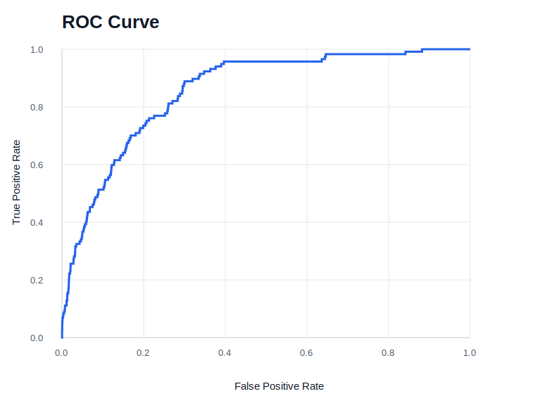
<figcaption>Figure 6.4. Baseline ROC curve.</figcaption>
</figure>

<figure>
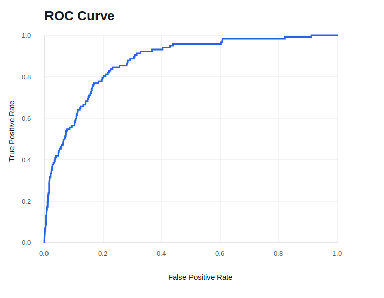
<figcaption>Figure 6.5. Multi-modal ROC curve. The AUC increases from 0.8550 to 0.8742 in the formal exported evaluations.</figcaption>
</figure>

## 6.4 Confusion-matrix analysis

| Model | TN | FP | FN | TP |
|---|---:|---:|---:|---:|
| Image-only | 5,916 | 592 | 57 | 60 |
| Multi-modal | 6,030 | 478 | 54 | 63 |
| Change | +114 | -114 | -3 | +3 |

The multi-modal model correctly reclassifies a net 117 additional samples: 114 fewer benign images are flagged and three more malignant images are detected. Across the paired predictions, the models disagree in correctness on 381 images. The multi-modal model corrects 249 baseline errors and introduces 132 errors on cases the baseline classified correctly. An exact paired McNemar test gives (p=2.11\times10^{-9}), indicating a difference in overall thresholded correctness on this validation set. Because benign cases dominate, this test mainly reflects the reduction in false positives and is not by itself evidence of clinical superiority.

<figure>
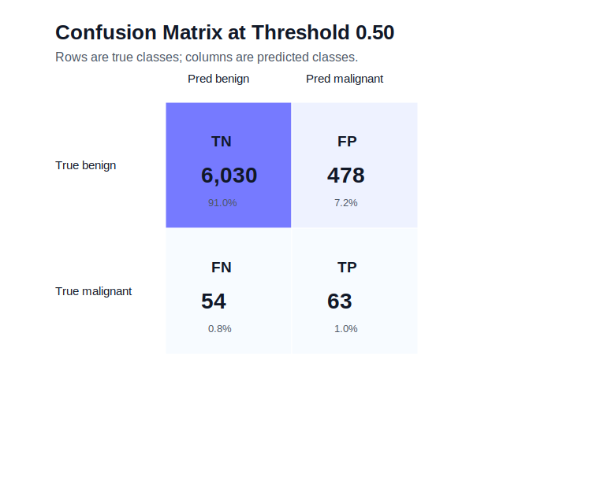
<figcaption>Figure 6.6. Multi-modal confusion matrix at the recorded default threshold.</figcaption>
</figure>

## 6.5 Paired bootstrap results

| Metric difference (multi-modal minus baseline) | Point estimate | 95% paired stratified bootstrap interval |
|---|---:|---:|
| ROC AUC | +0.0192 | **[+0.0070, +0.0318]** |
| Average precision | +0.0243 | [-0.0159, +0.0637] |
| Accuracy | +0.0177 | **[+0.0118, +0.0234]** |
| Malignant recall | +0.0256 | [-0.0427, +0.0940] |
| Specificity | +0.0175 | **[+0.0117, +0.0232]** |
| Malignant precision | +0.0244 | **[+0.0103, +0.0388]** |
| Malignant F1 | +0.0354 | **[+0.0131, +0.0584]** |
| Balanced accuracy | +0.0216 | [-0.0115, +0.0552] |

The AUC interval remains above zero, supporting a stable ranking improvement within the stored samples. Precision and F1 improvements are also positive under the specified resampling procedure. In contrast, the intervals for average precision, recall and balanced accuracy cross zero. The correct conclusion is therefore narrower than “metadata improves all aspects of melanoma detection”: the point estimates all improve, but the small number of malignant cases leaves uncertainty around several positive-class effects.

## 6.6 Precision-recall and threshold behaviour

<figure>
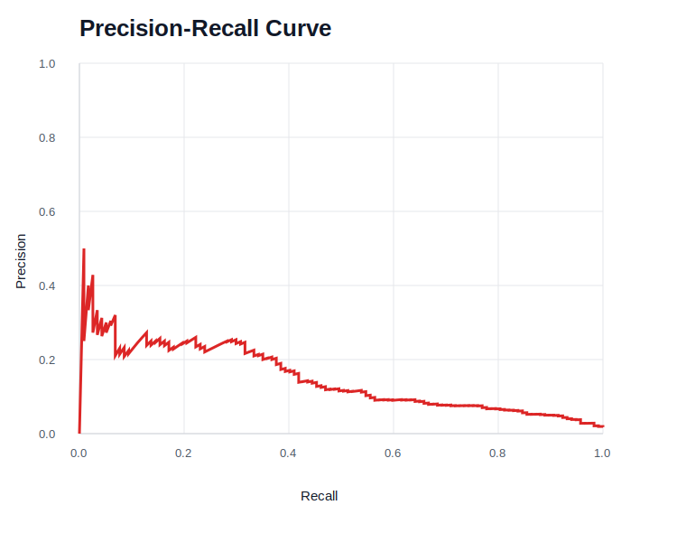
<figcaption>Figure 6.7. Multi-modal precision-recall curve. Average precision is 0.1519 against a malignant prevalence of approximately 0.0177.</figcaption>
</figure>

Average precision is far above the prevalence-level random reference but remains modest in absolute terms. Threshold adjustment can trade sensitivity against specificity and precision; it cannot create information that the model has not learned. A screening setting might prefer higher sensitivity, but doing so would generally increase false positives. The appropriate operating point requires explicit costs, calibrated probabilities and validation on the target population.

<figure>
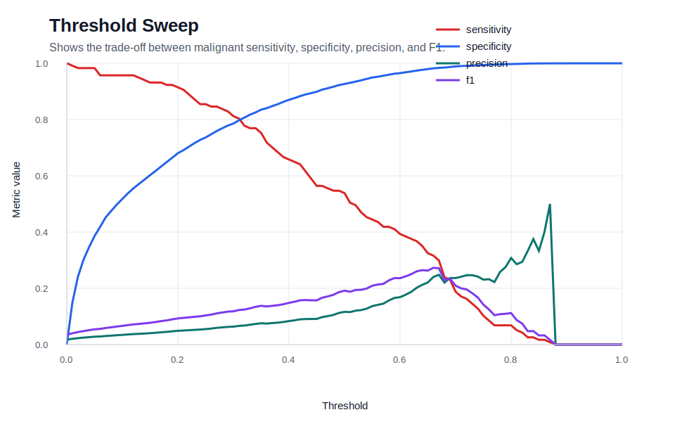
<figcaption>Figure 6.8. Threshold trade-off for sensitivity, specificity, precision and F1. The repository does not document a clinically selected operating threshold.</figcaption>
</figure>

## 6.7 Error examples

The archived error table includes false negatives with predicted malignant probabilities below 0.02 and false positives above 0.90. These confident errors are important because they show that probability magnitude alone does not guarantee correctness. Without lesion images and clinician review, the causes cannot be attributed to image artifacts, ambiguous morphology, metadata effects or label uncertainty. Qualitative error analysis should therefore be added only after the author lawfully retrieves the corresponding images and defines a review protocol.

## 6.8 Artifact consistency checks

Two consistency issues were identified. First, baseline model selection is ambiguous because the formal summary uses an AUC of 0.8550 although epoch 7 reached 0.8578. Comparing peak history AUCs yields 0.8742 minus 0.8578, or 0.0164; the direction of improvement remains unchanged. Second, the multi-modal `02_metrics_summary_clear.svg` subtitle calls the model a “ResNet50 baseline” even though its values and directory correspond to the multi-modal run. The CSV values are internally consistent with the plotted numbers, so the issue appears to be a label error. Both should be corrected in the final evidence package.

# 7. Discussion

## 7.1 Answer to RQ1: baseline behaviour

The image-only baseline ranks malignant cases reasonably well by internal ROC AUC, reaching 0.8550 in the formal summary. Its thresholded malignant performance is much weaker: recall is 0.5128, precision 0.0920 and F1 0.1560. The discrepancy is expected under a 1.77% positive prevalence. AUC evaluates ranking across thresholds, whereas precision describes the reliability of positive predictions at an operating point. The baseline therefore provides a useful technical comparator but not an acceptable diagnostic system.

## 7.2 Answer to RQ2: contribution of metadata

The multi-modal model improves the formal AUC by 0.0192 and reduces both false positives and false negatives. The paired bootstrap interval for the AUC difference is positive, and the F1 improvement is also positive under internal resampling. These results are consistent with the hypothesis that age, sex and anatomical site supply information not fully recoverable from image pixels.

The evidence does not show how the metadata is used. No metadata-only baseline or field ablation was run, so the relative value of age, sex and anatomical site is unknown. The improvement could also depend on correlations specific to the dataset. For example, anatomical site may encode acquisition practices or demographic structure rather than a portable clinical relationship. External and subgroup validation are required before interpreting the fusion as clinically robust.

## 7.3 Practical significance

Reducing false positives from 592 to 478 is operationally meaningful within the validation set because it lowers the number of benign cases flagged at the same nominal threshold. Increasing true positives from 60 to 63 is directionally valuable but based on only three additional detected melanomas. The recall interval crosses zero, so the evidence is insufficient to claim a reliable sensitivity improvement.

The model still produces 478 false positives for 63 true positives. In a low-prevalence screening population this ratio could create substantial follow-up burden. Conversely, 54 of 117 malignant validation images are missed. The system should therefore remain an educational prototype and should never reassure a user that a lesion is safe.

## 7.4 Relationship to prior work

The direction of the result agrees with multi-modal studies that combine skin-lesion images with contextual information [@Yap2018; @Ou2022; @Wang2022]. The architecture here is simpler and the evaluation narrower. This is a strength for causal clarity of the baseline comparison, but a limitation for state-of-the-art performance. The project contributes engineering integration and transparent artifact-level comparison rather than a novel fusion mechanism.

## 7.5 System implications

The end-to-end workflow demonstrates that the same conceptual inputs used during training can be collected in a mobile interface and processed by a backend service. Authentication and history make the prototype more realistic than a stateless notebook demo. However, integration success does not validate the model or the usability of the interface. Model, system and human evaluation are separate layers and require separate evidence.

Backend inference was a pragmatic choice because it avoids immediate ONNX conversion and permits aligned Python preprocessing. A future on-device implementation could improve privacy and offline availability but would introduce conversion, numerical-equivalence, model-size and device-performance questions. It should be treated as a new evaluated deployment, not a packaging detail.

## 7.6 Threats to validity

**Internal validity.** The same split was used for both models, which supports fairness, but checkpoint selection is inconsistent and several training details are absent. One run per model cannot separate architecture effects from random-seed variation.

**Construct validity.** Binary lesion classification on retrospective dermoscopic images is not equivalent to real-world melanoma screening. Default-threshold metrics do not capture calibration, referral cost or patient outcome.

**External validity.** The project has no external test set, smartphone acquisition test set, prospective users or distribution-shift analysis. Results may not transfer to consumer photographs, different dermatoscopes or underrepresented groups.

**Conclusion validity.** Only 117 validation positives limit precision around malignant metrics. Bootstrap analysis improves transparency but cannot repair dependence between lesions from one patient or validation-set reuse.

# 8. Ethics, Safety, Privacy and Security

## 8.1 Medical safety

The central safety requirement is non-diagnostic framing. The model can be wrong with high confidence and misses approximately 46% of malignant validation images at the recorded threshold. The application must state that the result is generated by an AI-assisted screening prototype, is not a final medical diagnosis and does not replace assessment by a qualified professional. It should advise professional review for concerning lesions regardless of model output.

The system should avoid a binary reassurance design. A benign label can be interpreted as permission to delay care. A safer research interface would emphasise uncertainty and intended limitations, avoid prescriptive advice, and make escalation information visible.

## 8.2 Bias and fairness

The dataset is imbalanced by diagnosis and has uneven representation across anatomical sites. Aggregate performance can conceal subgroup failures. Sex, age and location are model inputs, so they can improve prediction while also creating or amplifying disparity. The current artifacts do not report sensitivity, specificity or calibration by demographic subgroup. Future evaluation should predefine subgroups, report sample sizes and uncertainty, and avoid conclusions where groups are too small.

Skin tone is not available in the reported metadata. This prevents a direct fairness assessment across skin tones, a material limitation for dermatology systems. External datasets and clinically designed evaluation are needed.

## 8.3 Privacy and data governance

The public dataset is used for research under its stated licence [@ISIC2020]. The project does not collect new patient data for training. The prototype nevertheless allows users to submit lesion images and stores prediction history. Such data can be sensitive and potentially identifiable. Demonstrations should use authorised, de-identified test data and avoid real patient information.

A production design would require data minimisation, purpose limitation, consent or another appropriate lawful basis, retention limits, deletion, access logging, encryption in transit and at rest, incident response and a data-protection impact assessment. These controls fall outside the current prototype.

## 8.4 Security

JWT authentication provides a mechanism for associating requests with users, but security depends on secret storage, token expiry, password hashing, transport encryption and endpoint controls. File upload also creates risks including oversized payloads, malformed images and denial of service. History endpoints must enforce ownership checks. The current evidence does not establish these properties, so the final demonstration should not imply production security.

## 8.5 Accountability and transparency

The developer is responsible for documenting model version, preprocessing, threshold and limitations. A displayed probability should be accompanied by the model version and a clear explanation of what it represents. Predictions should be auditable without retaining unnecessary sensitive data. Any future clinical study would require appropriate ethics review and professional oversight.

# 9. Limitations and Future Work

## 9.1 Experimental limitations

The largest limitation is validation design. One internal image-level split is insufficient for a medical classifier. Patient-level separation must be verified, because lesions from one patient can share visual and contextual information. Repeated grouped cross-validation would quantify seed variability, and a held-out external dataset would test distribution shift.

The training evidence is incomplete. Exact loss, optimiser, class weighting, architecture details, dependency versions and checkpoint hashes are not present in this repository. The formal baseline summary also does not correspond to its peak recorded validation AUC. Final submission should archive configuration files, commit identifiers and immutable split manifests.

The study lacks a metadata-only baseline and ablations. These would show whether metadata alone is predictive and whether each field adds value. A fusion architecture comparison could then evaluate whether concatenation is sufficient.

## 9.2 Statistical and evaluation limitations

Only 117 malignant validation examples produce wide uncertainty for recall and average precision changes. The paired bootstrap treats sampled images as independent; this may be false if several lesions belong to one patient. Patient-clustered intervals are preferable when patient identifiers are available.

The model was evaluated at a default threshold and no calibrated operating point was selected. Future work should reserve data for calibration, report reliability diagrams and calibration error, and choose thresholds against a pre-specified screening objective. Decision-curve or cost-sensitive analysis could quantify the trade-off between missed melanomas and unnecessary referrals.

## 9.3 System limitations

Integration evidence is descriptive and lacks automated tests, latency measurements, screenshots and failure-case records. The source code referenced in the presentation is absent from the repository used for this dissertation draft. A final engineering evaluation should include unit, API and end-to-end tests; a compatibility matrix; request and inference latency on defined hardware; and evidence that each clinical category maps correctly.

No usability study was conducted. The clarity of confidence displays, disclaimers and navigation must be tested with representative users. A clinical workflow study would additionally need clinician involvement and ethics approval.

## 9.4 Prioritised future work

1. **Repair reproducibility:** archive code, environment, split manifest, model configuration, checkpoint hash and evaluation command.
2. **Verify grouped evaluation:** rebuild a patient-level split and repeat both models across multiple seeds.
3. **Add baselines and ablations:** metadata-only, age-only, sex-only, site-only and fusion variants.
4. **Calibrate and select a threshold:** use separate calibration data and a stated screening cost model.
5. **External validation:** evaluate on data from different institutions and on the actual mobile acquisition modality.
6. **Fairness analysis:** report performance and calibration by sex, age band, anatomical site and, where available, skin tone.
7. **Strengthen software evidence:** automated tests, security review, latency measurement and usability evaluation.
8. **Assess deployment alternatives:** compare backend PyTorch with verified ONNX or on-device inference for privacy, latency and numerical equivalence.

# 10. Conclusion

This dissertation designed and evaluated a mobile melanoma screening prototype based on feature-level fusion of dermoscopic images and structured clinical metadata. The image-only ResNet50 baseline achieved a formal internal-validation AUC of 0.8550 but low malignant precision and F1. Adding age, sex and anatomical site increased AUC to 0.8742, reduced false positives by 114, reduced false negatives by three and increased malignant F1 from 0.1560 to 0.1915. Paired internal resampling supports a positive AUC difference, while uncertainty remains for the changes in average precision, recall and balanced accuracy.

The result answers RQ1 and RQ2 with a qualified finding: the baseline has useful ranking ability but weak positive predictive performance, and the multi-modal model improves internal discrimination and thresholded error counts on the recorded split. The Flutter, FastAPI, PyTorch and SQLite workflow answers RQ3 at prototype level by demonstrating authenticated image-and-metadata inference, result display and history retrieval.

The project does not establish a clinically deployable diagnostic system. Severe imbalance, possible patient leakage, incomplete reproducibility evidence, single-split validation, lack of external testing and low malignant precision constrain the claim. The appropriate contribution is therefore a traceable proof of concept: simple clinical-context fusion adds measurable value to an image baseline and can be integrated into a mobile workflow, but safe use requires substantially stronger experimental, software and human evaluation.

# References

# Appendix A. Evidence and Reproducibility Checklist

## A.1 Evidence used in this draft

| Evidence | Location | Purpose |
|---|---|---|
| Project log-book | `Project Log-book.md` | scope, decisions, schedule, ethics and experiment descriptions |
| Baseline metrics | `experiments/baseline/metrics_summary.csv` | formal baseline comparison |
| Baseline history | `experiments/baseline/history.csv` | epoch-level behaviour |
| Baseline predictions | `experiments/baseline/predictions.csv` | recalculation and paired analysis |
| Multi-modal metrics | `experiments/multimodal/metrics_summary.csv` | formal fusion comparison |
| Multi-modal history | `experiments/multimodal/history.csv` | epoch-level behaviour |
| Multi-modal predictions | `experiments/multimodal/predictions.csv` | recalculation and paired analysis |
| Evaluation figures | `experiments/*/report_figures/` | plots and dataset summaries |
| Integration record | `experiments/application-integration/README.md` | end-to-end workflow evidence |
| Mid-term presentation | `Mid-term Presentation.pptx` | detailed architecture and preprocessing record |

## A.2 Items required before final submission

- [ ] Replace student ID, submission date, acknowledgements and official declaration placeholders.
- [ ] Confirm the exact 2025/26 School of Computer Science cover, declaration, AI-use and citation requirements.
- [ ] Confirm the module's official page and formatting rules from Blackboard.
- [ ] Add the original backend and Flutter source code or cite a stable commit containing it.
- [ ] Add dataset-preparation and training scripts.
- [ ] Record Python, PyTorch, torchvision and operating-system versions.
- [ ] Record optimiser, loss, class weights, MLP layers, activations, dropout and scheduler.
- [ ] Export a split manifest containing patient ID, image ID and subset; verify no patient overlap.
- [ ] Explain and correct baseline checkpoint selection.
- [ ] Correct the multi-modal metrics-figure subtitle.
- [ ] Add checkpoint hashes and the exact evaluation command.
- [ ] Run at least three seeds or grouped cross-validation if time permits.
- [ ] Add automated API and end-to-end test evidence.
- [ ] Add screenshots only after checking that they contain no personal or sensitive data.
- [ ] Review every claim and citation against the original source.

# Appendix B. Additional Experimental Figures

<figure>
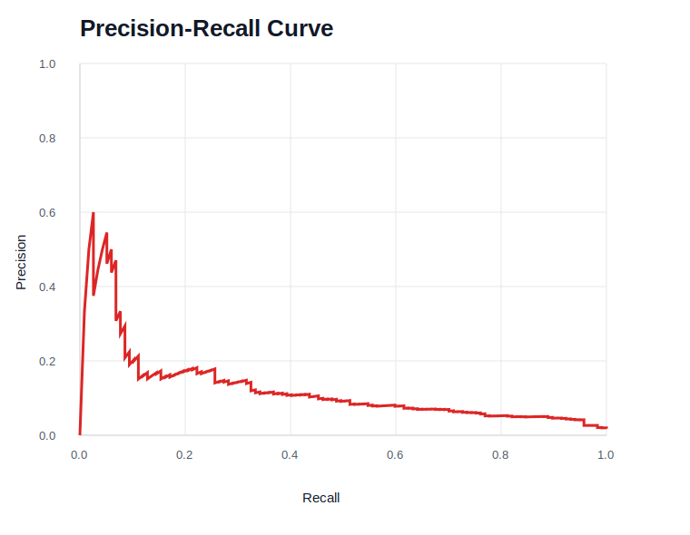
<figcaption>Figure B.1. Baseline precision-recall curve.</figcaption>
</figure>

<figure>
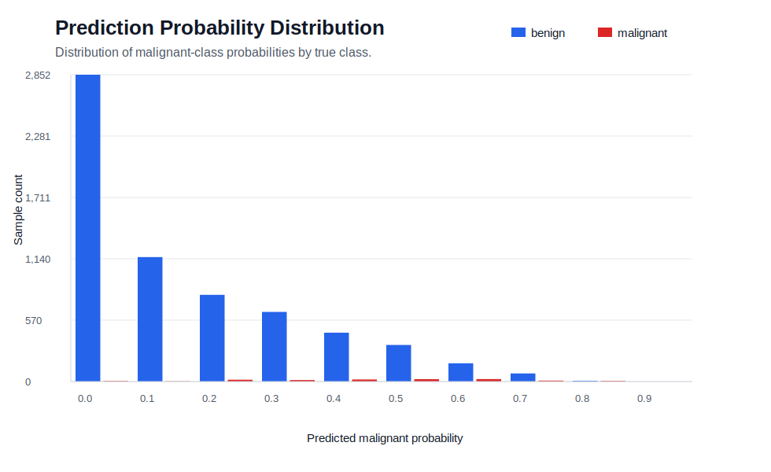
<figcaption>Figure B.2. Baseline predicted-probability distribution.</figcaption>
</figure>

<figure>
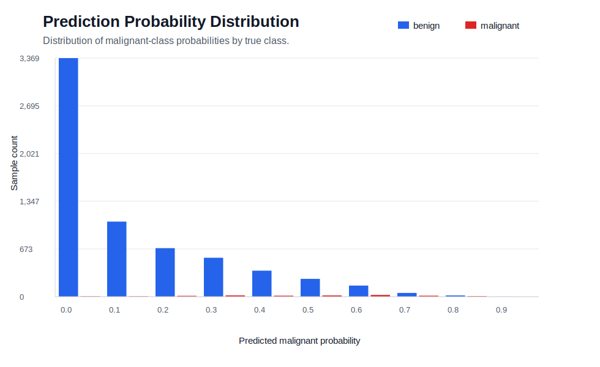
<figcaption>Figure B.3. Multi-modal predicted-probability distribution.</figcaption>
</figure>

<figure>
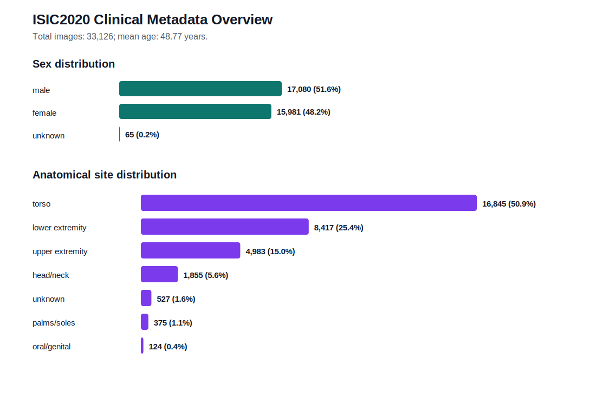
<figcaption>Figure B.4. Distribution of recorded clinical metadata.</figcaption>
</figure>

<figure>
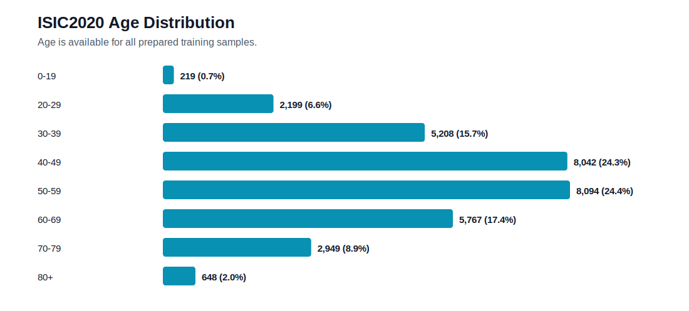
<figcaption>Figure B.5. Approximate-age distribution in the prepared dataset.</figcaption>
</figure>

# Appendix C. Statistical Analysis Specification

The paired bootstrap reported in Chapter 6 used the two archived `predictions.csv` files. Image names and labels were asserted to match. Malignant and benign indices were sampled separately with replacement to preserve the validation class counts. The same resampled indices were applied to both models, preserving pairing. Two thousand replicates were generated with NumPy seed 20260619. The intervals are percentile intervals and should be regenerated from a patient-grouped resampling unit if patient identifiers become available.

The exact McNemar test used the two models' correctness at probability threshold 0.5. Of 381 discordant cases, 249 changed from baseline-incorrect to multi-modal-correct and 132 changed in the opposite direction. The two-sided exact binomial probability is (2.11\times10^{-9}). This test is dominated by benign cases and is reported as an overall paired classification check, not a melanoma-sensitivity test.
